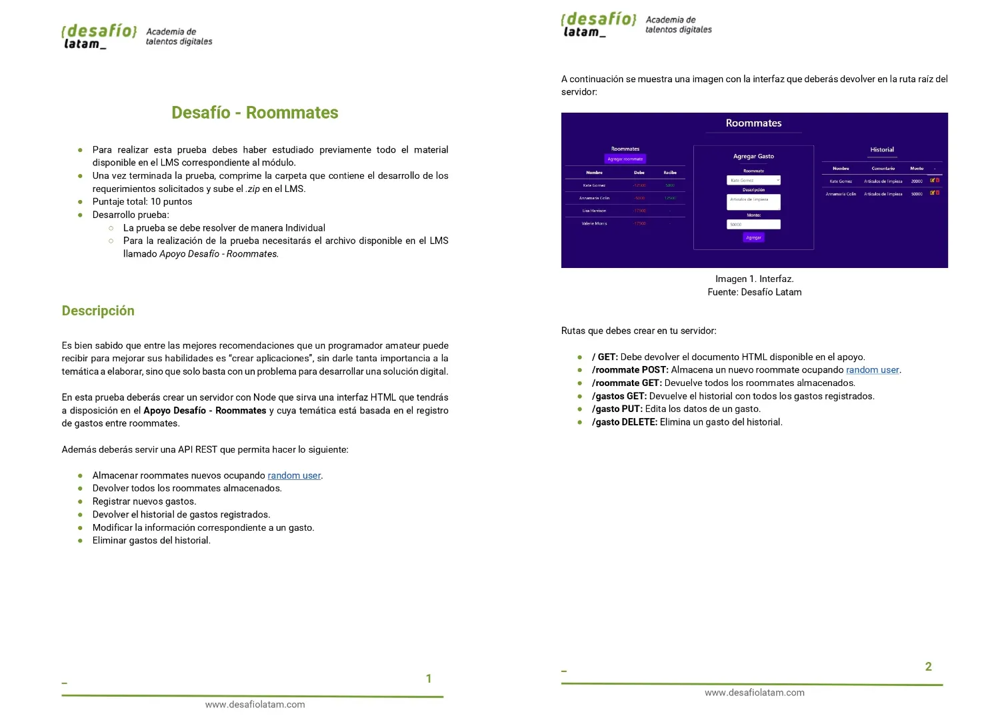
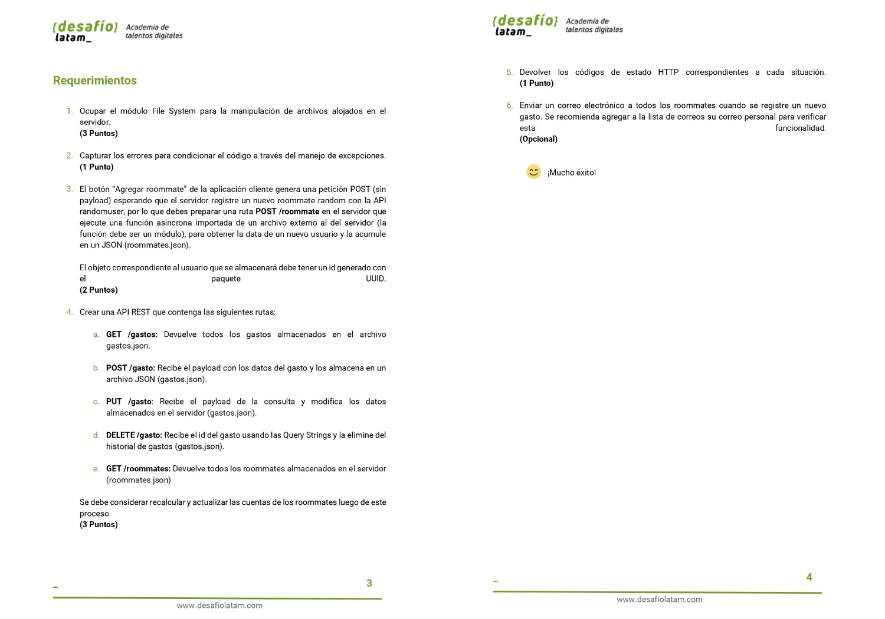
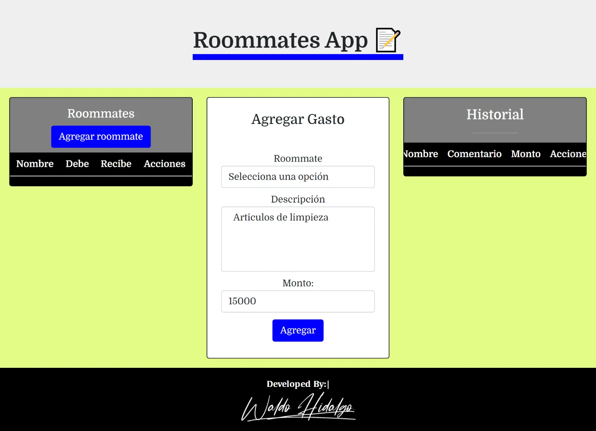
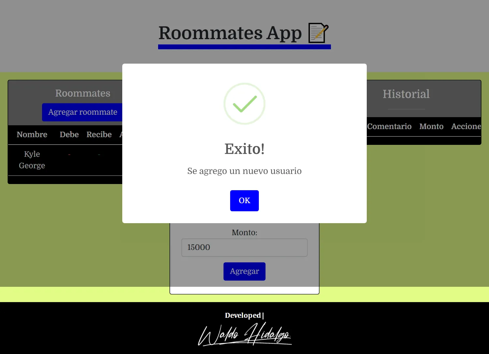
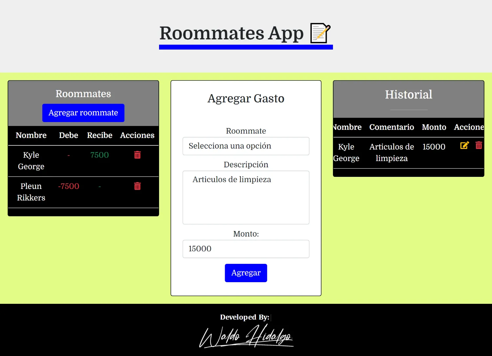
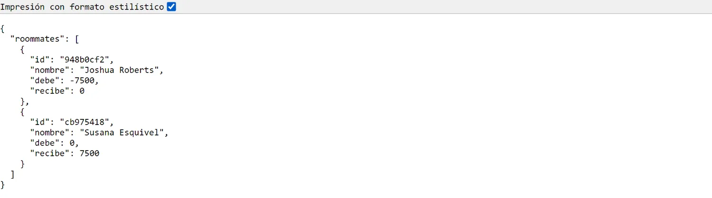
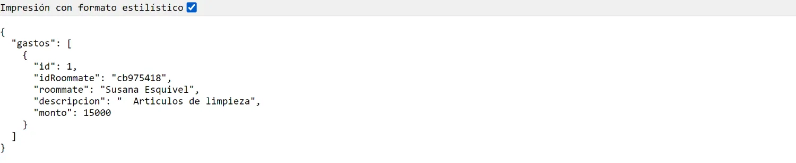

# Solución al desafío Roommates

El presente repositorio contiene el código solución del desafío 1 del módulo 8 **Implementación de API backend Node Express** de la beca **Desarrollo de aplicaciones Full Stack Javascript Trainee** dictada por Desafío Latam

## Tabla de Contenidos

- [Solución al desafío Roommates](#solución-al-desafío-roommates)
  - [Tabla de Contenidos](#tabla-de-contenidos)
  - [Deploy](#deploy)
  - [Requerimientos](#requerimientos)
  - [Diagrama de Flujo](#diagrama-de-flujo)
    - [1.Estado Inicial](#1estado-inicial)
    - [2.Alerta Creación exitosa de usuario](#2alerta-creación-exitosa-de-usuario)
    - [3.Alerta Creación exitosa de gasto](#3alerta-creación-exitosa-de-gasto)
    - [4. Agregación exitosa de gasto](#4-agregación-exitosa-de-gasto)
    - [5.Alerta Edición exitosa de gasto](#5alerta-edición-exitosa-de-gasto)
    - [6.Alerta Eliminación exitosa de gasto](#6alerta-eliminación-exitosa-de-gasto)
    - [7.Ruta get roommates](#7ruta-get-roommates)
    - [7.Ruta get gastos](#7ruta-get-gastos)
  - [Soluciones](#soluciones)
    - [1. Ocupar el módulo File System para la manipulación de archivos alojados en el servidor. (3 Puntos)](#1-ocupar-el-módulo-file-system-para-la-manipulación-de-archivos-alojados-en-el-servidor-3-puntos)
    - [2. Capturar los errores para condicionar el código a través del manejo de excepciones. (1 Punto)](#2-capturar-los-errores-para-condicionar-el-código-a-través-del-manejo-de-excepciones-1-punto)
    - [3. El botón “Agregar roommate” de la aplicación cliente genera una petición POST (sin payload) esperando que el servidor registre un nuevo roommate random con la API randomuser, por lo que debes preparar una ruta POST /roommate en el servidor que ejecute una función asíncrona importada de un archivo externo al del servidor (la función debe ser un módulo), para obtener la data de un nuevo usuario y la acumule en un JSON (roommates.json)](#3-el-botón-agregar-roommate-de-la-aplicación-cliente-genera-una-petición-post-sin-payload-esperando-que-el-servidor-registre-un-nuevo-roommate-random-con-la-api-randomuser-por-lo-que-debes-preparar-una-ruta-post-roommate-en-el-servidor-que-ejecute-una-función-asíncrona-importada-de-un-archivo-externo-al-del-servidor-la-función-debe-ser-un-módulo-para-obtener-la-data-de-un-nuevo-usuario-y-la-acumule-en-un-json-roommatesjson)
    - [4. Crear una API REST que contenga las siguientes rutas](#4-crear-una-api-rest-que-contenga-las-siguientes-rutas)
      - [4.1. GET /gastos: Devuelve todos los gastos almacenados en el archivo gastos.json](#41-get-gastos-devuelve-todos-los-gastos-almacenados-en-el-archivo-gastosjson)
      - [4.2. POST /gasto: Recibe el payload con los datos del gasto y los almacena en un archivo JSON (gastos.json)](#42-post-gasto-recibe-el-payload-con-los-datos-del-gasto-y-los-almacena-en-un-archivo-json-gastosjson)
      - [4.3. PUT /gasto: Recibe el payload de la consulta y modifica los datos almacenados en el servidor (gastos.json)](#43-put-gasto-recibe-el-payload-de-la-consulta-y-modifica-los-datos-almacenados-en-el-servidor-gastosjson)
      - [4.4. DELETE /gasto: Recibe el id del gasto usando las Query Strings y la elimine del historial de gastos (gastos.json)](#44-delete-gasto-recibe-el-id-del-gasto-usando-las-query-strings-y-la-elimine-del-historial-de-gastos-gastosjson)
      - [4.5. GET /roommates: Devuelve todos los roommates almacenados en el servidor (roommates.json). Se debe considerar recalcular y actualizar las cuentas de los roommates luego de este proceso. (3 Puntos)](#45-get-roommates-devuelve-todos-los-roommates-almacenados-en-el-servidor-roommatesjson-se-debe-considerar-recalcular-y-actualizar-las-cuentas-de-los-roommates-luego-de-este-proceso-3-puntos)
    - [5. Devolver los códigos de estado HTTP correspondientes a cada situación. (1 Punto)](#5-devolver-los-códigos-de-estado-http-correspondientes-a-cada-situación-1-punto)
  - [Extra](#extra)

## Deploy

El proyecto es completamente funcional y lo he desplegado a Render en el siguiente [link](https://desafio-roommates.onrender.com/)

## Requerimientos




## Diagrama de Flujo

### 1.Estado Inicial



### 2.Alerta Creación exitosa de usuario



### 3.Alerta Creación exitosa de gasto


### 4. Agregación exitosa de gasto



### 5.Alerta Edición exitosa de gasto


### 6.Alerta Eliminación exitosa de gasto


### 7.Ruta get roommates



### 7.Ruta get gastos



## Soluciones

### 1. Ocupar el módulo File System para la manipulación de archivos alojados en el servidor. (3 Puntos)

He ocupado el módulo **File System** adaptado para trabajar con promesas tal y como muestro a continuación:

```js
import { promises as fs } from "fs";
```

### 2. Capturar los errores para condicionar el código a través del manejo de excepciones. (1 Punto)

Todo mi código ya sea front end o back end utiliza bloques **try y catch** para el manejo de errores

### 3. El botón “Agregar roommate” de la aplicación cliente genera una petición POST (sin payload) esperando que el servidor registre un nuevo roommate random con la API randomuser, por lo que debes preparar una ruta POST /roommate en el servidor que ejecute una función asíncrona importada de un archivo externo al del servidor (la función debe ser un módulo), para obtener la data de un nuevo usuario y la acumule en un JSON (roommates.json)

El objeto correspondiente al usuario que se almacenará debe tener un id generado con el paquete UUID. (2 Puntos)

Para crear un usuario utilizando la API de Randomuser, he creado el siguiente código:

```js
import { promises as fs } from "fs";
import path from "path";
import { v4 as uuidv4 } from "uuid";
import { calcularDebeHaber } from "./utils.js";
const crearUsuario = async () => {
  try {
    const id = uuidv4().slice(0, 8);

    const dataAPI = await fetch("https://randomuser.me/api/?results=1");
    const { results: data } = await dataAPI.json();
    const dataUsuario = data[0];
    const nombre = dataUsuario.name.first + " " + dataUsuario.name.last;
    const usuario = {
      id,
      nombre,
      debe: null,
      recibe: null,
    };
    const filePath = path.join(path.resolve(), "data", "roommates.json");
    const dataJSON = await fs.readFile(filePath, "utf-8");

    const dataParse = JSON.parse(dataJSON);
    dataParse.roommates.push(usuario);

    const filePathGastos = path.join(path.resolve(), "data", "gastos.json");
    const dataJSONGastos = await fs.readFile(filePathGastos, "utf-8");
    const dataParseGastos = JSON.parse(dataJSONGastos);
    const gastos = dataParseGastos.gastos;
    const nuevosRoommates = calcularDebeHaber(gastos, dataParse.roommates);
    const nuevoObjetoData = { roommates: nuevosRoommates };
    await fs.writeFile(
      filePath,
      JSON.stringify(nuevoObjetoData, null, 2),
      "utf-8",
    );
    return nuevoObjetoData;
  } catch (error) {
    return error;
  }
};

export default crearUsuario;
```

Dicho código lo utilizo en el siguiente middleware:

```js
export async function postRoommate(req, res) {
  try {
    await crearUsuario();
    res.status(200).send("usuario creado");
  } catch (error) {
    res.status(500).send(error);
  }
}
```

La ruta que crea un usuario es la siguiente:

```js
router.post("/roommate", postRoommate);
```

### 4. Crear una API REST que contenga las siguientes rutas

#### 4.1. GET /gastos: Devuelve todos los gastos almacenados en el archivo gastos.json

He creado la siguiente ruta que devuelve todos los gastos almacenados en el archivo gastos.json:

```js
router.get("/gastos", getGastos);
```

#### 4.2. POST /gasto: Recibe el payload con los datos del gasto y los almacena en un archivo JSON (gastos.json)

La siguiente ruta me permite crear un gasto:

```js
router.post("/gasto", postGasto);
```

#### 4.3. PUT /gasto: Recibe el payload de la consulta y modifica los datos almacenados en el servidor (gastos.json)

La siguiente ruta me permite editar un gasto:

```js
router.put("/gasto", updateGasto);
```

#### 4.4. DELETE /gasto: Recibe el id del gasto usando las Query Strings y la elimine del historial de gastos (gastos.json)

La siguiente ruta me permite eliminar un gasto:

```js
router.delete("/gasto", deleteGasto);
```

#### 4.5. GET /roommates: Devuelve todos los roommates almacenados en el servidor (roommates.json). Se debe considerar recalcular y actualizar las cuentas de los roommates luego de este proceso. (3 Puntos)

La siguiente ruta me permite devuelve todos los roommates almacenados en el servidor (roommates.json):

```js
router.get("/roommates", getRoommates);
```

### 5. Devolver los códigos de estado HTTP correspondientes a cada situación. (1 Punto)

He devuelto los códigos de estado para cada situación y procedo a manejarlos en el front end. A continuación muestro un ejemplo:

```js
export async function getRoommates(req, res) {
  try {
    const filePath = path.join(path.resolve(), "data", "roommates.json");
    const dataJSON = await fs.readFile(filePath, "utf-8");
    const dataParse = JSON.parse(dataJSON);
    res.json(dataParse);
  } catch (error) {
    res.status(500).send(error);
  }
}
```

## Extra

Creación de ruta **reset** para reseteo de data cada 30 minutos:

```js
router.get("/reset", resetData);
```

Para lo cual he creado el siguiente middleware:

```js
export async function resetData(req, res) {
  try {
    await fs.writeFile(
      path.join(path.resolve(), "data", "roommates.json"),
      JSON.stringify({ roommates: [] }, null, 2),
      "utf-8",
    );
    await fs.writeFile(
      path.join(path.resolve(), "data", "gastos.json"),
      JSON.stringify({ gastos: [] }, null, 2),
      "utf-8",
    );
    res.status(200).send("Data reseteada 😄");
  } catch (error) {
    res.status(500).send(error);
  }
}
```

Y el siguiente **setInterval**:

```js
setInterval(async () => {
  try {
    const response = await fetch(
      "https://desafio-roommates.onrender.com/reset",
      {
        method: "GET",
      },
    );
    if (response.status === 200) {
      console.log("Se reinicio el servidor exitosamente");
      return;
    } else {
      throw new Error("No se pudo reiniciar el servidor");
    }
  } catch (error) {
    console.error("Error al llamar a la ruta:", error);
  }
}, 1800000);
```
